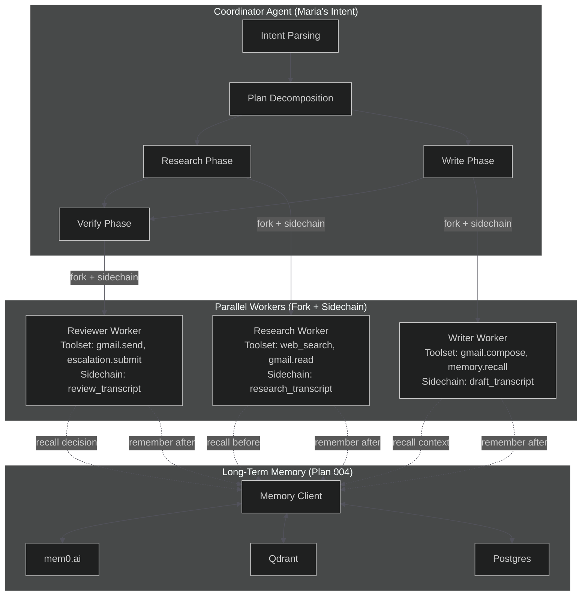
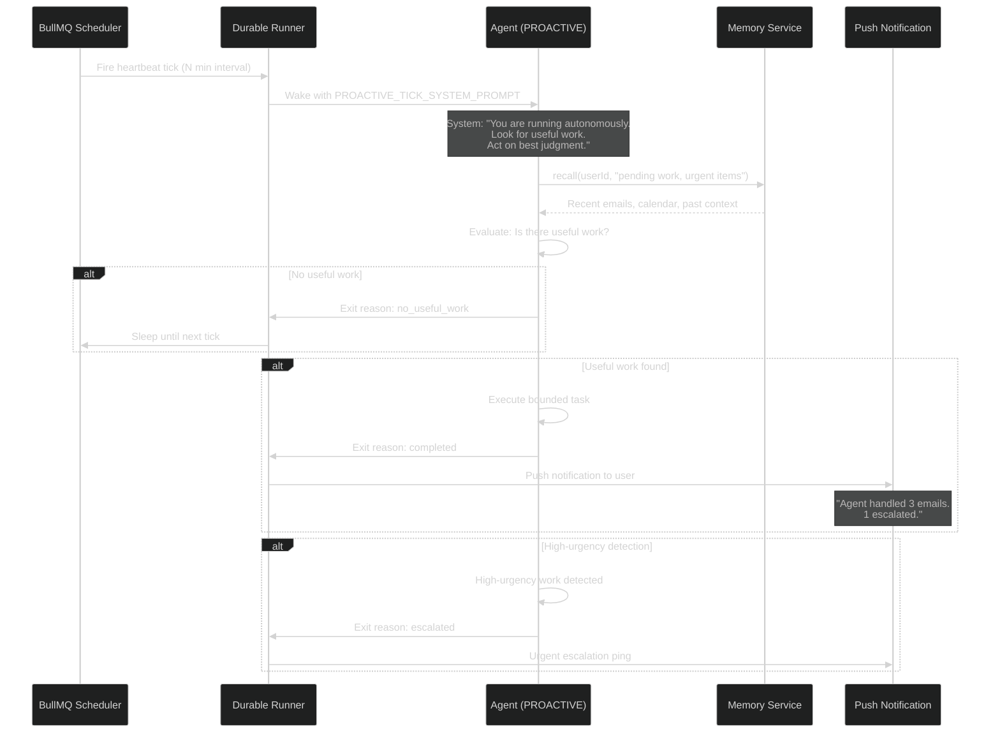
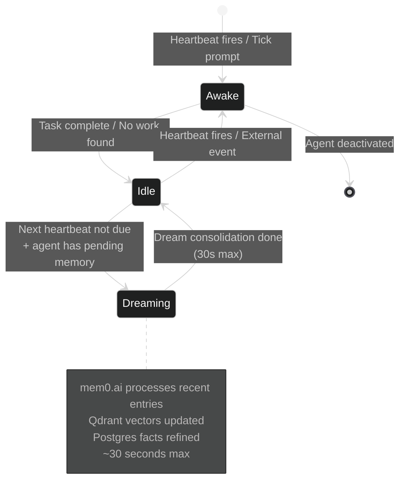
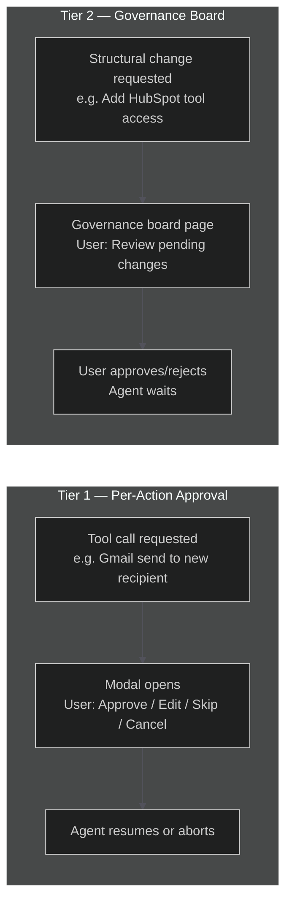

# AgentOS Phase 2 — Unified Implementation Plan

## Overview

Phase 2 transforms AgentOS from a **scheduled task runner** into an **always-on intelligent agent platform**. Eight items span memory, multi-agent orchestration, autonomous action, calendar integration, governance, and budget controls.

**Foundation dependency:** This plan builds on two existing Phase 1 plans — Working Memory (`003`) and Long-Term Memory Microservice (`004`) — which are incorporated by reference, not duplicated. All later Phase 2 units depend on the memory layer being in place first.

**Strategic frame:** Claude Code's KAIROS (154 refs), PROACTIVE (37 refs), and COORDINATOR_MODE (32 refs) confirm this is the correct architectural direction. We are parallel-pathing a company with far more resources on the same target. The competitive window is 6–12 months.

---

## Problem Frame

### Where We Are (End of Phase 1)

AgentOS agents are **scheduled workers** — they wake on a cron, do bounded work, sleep. They have:
- Working memory (per-session, ephemeral)
- Per-action escalation (modal approval for dangerous ops)
- A single agent per task

This is sufficient for Maria's morning email check, but insufficient for:
- An agent that acts on urgent events between heartbeats
- Multiple agents that coordinate (research → draft → review)
- An agent that learns user preferences over weeks
- Always-on monitoring with push notifications

### Where We Need to Be (End of Phase 2)

AgentOS agents are **persistent AI employees** — they run continuously, learn over time, delegate to sub-agents, and act on judgment between user interactions. The product thesis "Hire an AI employee. It works while you sleep." becomes fully real.

### Core Architectural Shifts

| Phase 1 | Phase 2 |
|---------|---------|
| Scheduled wake → act → sleep | Always-on → act → dream consolidation → act |
| Single agent per task | Coordinator + parallel workers |
| Stateless between heartbeats | Long-term memory across sessions |
| Agent waits for user | PROACTIVE: agent acts, notifies after |
| Per-action escalation | Tier 2 governance board for structural changes |
| Manual budget monitoring | Auto-pause on budget exceeded |

---

## Requirements Trace

Map each Phase 2 PRD item to its plan unit:

| PRD Item | Section | Plan Unit |
|----------|---------|-----------|
| Long-term memory (mem0.ai + Qdrant) | PRD 916 | Unit 1: Long-Term Memory (plan 004) — incorporated |
| Template gallery (6–10 templates) | PRD 374–383 | Unit 7: Template Gallery |
| Multi-agent delegation (COORDINATOR_MODE) | PRD 448–465 | Units 2–3: Multi-Agent Core + Coordinator |
| PROACTIVE agent mode | PRD 466–479 | Unit 4: PROACTIVE Tick Loop |
| KAIROS daemon mode (dream consolidation) | PRD 270–274, 710–714 | Unit 5: KAIROS Dream Consolidation |
| Calendar OAuth | PRD 356 | Unit 6: Calendar OAuth |
| Escalation governance board (Tier 2) | PRD 286–298 | Unit 8: Governance Board |
| Auto-pause on budget exceeded | PRD 315 | Unit 9: Auto-Pause on Budget Exceeded |

---

## Scope Boundaries

### In Scope for Phase 2

- Everything in the 8-item PRD Phase 2 list
- Persistent multi-agent orchestration (not just parallel tool calls)
- Always-on agent mode with sleep-state memory processing
- Push-based user notifications (not just in-app polling)
- Tier 2 escalation governance (structural changes to agent team)
- Template gallery with 6–10 pre-built agents

### Out of Scope for Phase 2 (Phase 3)

- CRM integrations (HubSpot, Salesforce) — Phase 3
- Slack integration — Phase 3
- Agent marketplace — Phase 3
- Multi-user team collaboration — Phase 3
- Remote bridge architecture (persistent cloud agents) — Phase 3
- Mobile experience — Phase 3
- Agent marketplace or public sharing — Phase 3

### Known Scope Creep Risks

- **Distributed multi-agent:** Keep to single-process coordinator + workers in Phase 2. Distributed coordination is Phase 3.
- **Memory TTL/expiration:** Plan 004 notes this as out-of-scope. Do not add in Phase 2 without a separate plan.
- **Multi-modal memory:** Out of scope per plan 004. Text only.

---

## Key Technical Decisions

### Decision 1: Memory Before Autonomous Action

**Ruling:** Long-term memory (Units from plan 004) must be **fully deployed before** PROACTIVE (Unit 4) or KAIROS (Unit 5) begins.

**Rationale:** An always-on agent without persistent memory acts on stale or no context. PROACTIVE and KAIROS both depend on the agent having cross-session context to make good autonomous decisions. You cannot have useful "dream consolidation" without something to consolidate.

**Dependency chain:**
```
Plan 004 (Long-Term Memory) → Plan 003 (Working Memory) → Unit 1 (Runner Memory Integration)
    → Unit 2 (Multi-Agent Core) → Unit 3 (Coordinator) → Unit 4 (PROACTIVE) → Unit 5 (KAIROS)
```

### Decision 2: COORDINATOR_MODE Maps to Fork + Sidechain

**Ruling:** Multi-agent delegation uses Claude Code's **fork subagent + sidechain transcript** pattern, not a separate process model.

**Rationale:** From `coordinatorMode.ts` + `forkSubagent.ts` + `runAgent.ts` analysis:
- Fork subagents share byte-identical prompt prefix = prompt cache hits across agents
- Sidechain transcripts isolate each agent's history without polluting the parent's trace
- The coordinator uses a restricted tool set and spawns workers for research → implementation → verification phases
- This maps directly to AgentOS's research agent + writer agent + reviewer agent workflow

**AgentOS-specific mapping:**
```
Coordinator Agent (Maria's intent)
  ├── Research Worker (fork + sidechain)
  │     └── Web search + Gmail read (shared context)
  ├── Writer Worker (fork + sidechain, after research)
  │     └── Drafts using research context
  └── Reviewer Worker (after writer)
        └── Escalates if needed, otherwise completes
```

**Inter-agent notification protocol (from ccleaks.com):** Workers communicate via `<task-notification>` XML protocol (not HTTP polling). Fields: `status`, `summary`, `tokens`, `duration`. Scratch isolation via `tengu_scratch` directory per worker. Workers `Continue` via `SendMessage` back to coordinator.

**Key constraint:** Fork recursion must be bounded. Use `<FORK_BOILERPLATE_TAG>` equivalent — max 2 levels of delegation for Phase 2.

### Decision 3: PROACTIVE Tick-Scheduling Architecture

**Ruling:** PROACTIVE uses a **`<tick>` prompt injection** architecture where the agent is woken periodically and asked "is there useful work?" — gated by GrowthBook feature flag `tengu_onyx_plover`.

**Rationale:** From Claude Code PROACTIVE analysis (37 refs) + ccleaks.com, the agent receives a special `<tick>` XML prompt at each wake cycle. Build flag `PROACTIVE` ("bg sleeping agents") controls availability. The tick prompt tells the agent to evaluate useful work and either act (bounded) or call `Sleep`.

**AgentOS implementation:**
- Feature flag gate: `tengu_onyx_plover` (GrowthBook) controls PROACTIVE enablement per user
- Tick prompt is a special system prompt injected at wake: `PROACTIVE_TICK_SYSTEM_PROMPT`
- Agent evaluates: is there work? should I act? should I wait?
- If acting: execute bounded task → send push notification (`PushNotification` tool) → return to sleep
- If waiting: log "no useful work" → call `SleepTool` → sleep until next tick
- PROACTIVE status modes: `normal` (reactive) and `proactive` (tick-driven)

**Different from cron:** A cron agent runs whether or not there's useful work. A PROACTIVE agent evaluates first. This reduces unnecessary runs and user notifications.

### Decision 4: KAIROS Dream Consolidation

**Ruling:** KAIROS dream consolidation is a **background memory processing task** that runs during agent idle time between heartbeats, using a 4-phase pipeline: Orient → Gather → Consolidate → Prune.

**Rationale:** From Claude Code KAIROS analysis (154 refs) + ccleaks.com, "dream" state is periodic memory processing while idle. Dream trigger requires ≥24h idle AND ≥5 sessions since last dream. GitHub `SubscribePR` and Gmail push subscriptions keep the agent aware of external events without constant polling. Dream output is capped at <25KB to avoid resource waste.

**AgentOS implementation:**
- Agent has three states: `awake` (active work), `idle` (between heartbeats), `dreaming` (memory consolidation)
- Dream trigger conditions (both required): idle ≥24h since last active session AND ≥5 sessions since last dream
- Dream 4-phase pipeline: **Orient** (load recent context, identify themes) → **Gather** (collect related memory entries) → **Consolidate** (LLM re-phrases, deduplicates, extracts insights) → **Prune** (remove stale or redundant entries)
- Refinement via mem0.ai `update()` (delete + re-add pattern) — mem0.ai has no importance scores API
- Dream output capped at <25KB total to avoid resource waste
- Dream consolidation runs as a bounded background task (max 30–60 seconds)
- KAIROS exclusive tools: `SendUserFile`, `PushNotification`, `SubscribePR`, `SleepTool` — agents in dream state get a restricted tool set, not general-purpose tools

**Gmail push notifications** (Phase 2): Instead of polling Gmail every N minutes, use Gmail push notifications (Google Pub/Sub or webhook) to wake the agent only when new email arrives. This is the critical path for KAIROS to be power-efficient.

### Decision 5: Template Gallery Uses Skills Directory Convention

**Ruling:** Templates are implemented as a **skills directory** (`skills/<name>/SKILL.md`) following Claude Code's bundled skills pattern.

**Rationale:** From `loadSkillsDir.ts` analysis, skills are directory-based prompts with YAML frontmatter. They support conditional activation, custom tools, and user edits. This is strictly more powerful than hardcoded templates and deprecates the Phase 1 template picker gracefully.

**Template → Skill mapping:**
| Phase 1 Template | Phase 2 Skill |
|-----------------|----------------|
| Customer Email Handler | `skills/email-handler/SKILL.md` |
| Lead Researcher | `skills/lead-researcher/SKILL.md` |
| Support Drafter | `skills/support-drafter/SKILL.md` |
| Competitive Monitor | `skills/competitive-monitor/SKILL.md` |
| Content Curator | `skills/content-curator/SKILL.md` |
| Meeting Prep | `skills/meeting-prep/SKILL.md` |

**SKILL.md frontmatter schema:**
```yaml
name: email-handler
description: Handles inbound customer emails with escalation for external send
trigger: "email"  # activates when user intent matches
context: "inbound|customer|support"
allowed-tools: [gmail.read, gmail.compose, memory.recall]
heartbeat: "daily 9am UTC"
escalation: "external recipients require approval"
resource-budget: "standard"
```

### Decision 6: Escalation Governance Board (Tier 2) is a Dashboard Page

**Ruling:** Tier 2 governance is a **dedicated React page** (not a modal) showing structural changes pending approval.

**Rationale:** From PRD 286–298, Tier 2 covers structural changes: hiring a new agent, changing tool access, adjusting budgets, deleting an agent. These are not time-sensitive (unlike Tier 1 per-action approval) but require human review. A dashboard page is appropriate.

**UI structure:**
- Activity log gets a new filter: "Governance" — shows Tier 2 pending/completed items
- Governance board shows: agent change request, what changed, who requested, when
- User approves/rejects via the board — agent waits until decision

### Decision 7: Auto-Pause on Budget Exceeded

**Ruling:** Budget monitoring is **agent-level enforcement** in the runner, not a background polling service.

**Rationale:** Phase 1 has budget tracking on agent cards. Phase 2 adds auto-pause when budget is exceeded. This is a runner concern: after each tool call, check cumulative spend. If exceeded → set agent state to `paused` → send notification → stop scheduling new heartbeats.

**Implementation:** No new service. Extend `ResourceBudgetTracker` in the runner. Budget state is persisted in Postgres. BullMQ scheduler checks agent state before firing.

---

## Open Questions

### Deferred to Planning

| Question | Why Deferred | Resolution Owner |
|----------|--------------|-----------------|
| How does PROACTIVE mode handle conflicting actions from multiple agents? | Requires multi-agent coordination protocol design | Unit 4 (PROACTIVE) |
| What is the dream consolidation refinement prompt? How does the LLM re-phrase memory entries? | Needs prompt engineering + evaluation of quality | Unit 5 (KAIROS) |
| How do webhook subscriptions scale? If 1000 users have Gmail push, how does AgentOS receive them? | Requires infrastructure design — Vercel Edge + Cloudflare Workers receiver + Pub/Sub fan-out | Unit 5 (KAIROS) |
| Should Tier 2 governance be async (agent waits) or sync (user notified, agent continues)? | Product decision — affects agent behavior when user is offline | Unit 8 (Governance Board) |
| How are templates versioned? If a skill is updated, do deployed agents auto-update? | Template versioning policy — affects deployed agent stability | Unit 7 (Template Gallery) |
| What is the rollback story for auto-pause? Can the agent auto-resume when budget resets? | Budget reset is monthly (billing cycle) — policy decision | Unit 9 (Auto-Pause) |

### Resolved During Planning

| Question | Resolution | Evidence |
|----------|-----------|----------|
| KAIROS daemon = always-on + dream consolidation, not a separate process | Confirmed: KAIROS uses existing BullMQ scheduler + background idle task | PRD 270–274, 710–714 |
| PROACTIVE tick prompt uses special system prompt injection | Confirmed: tick prompt is a system prompt variant, not a new agent type | claude-code-harness-analysis.md 503–510 |
| COORDINATOR_MODE uses fork + sidechain, not IPC or message passing | Confirmed: forkSubagent + sidechain transcript pattern | claude-code-harness-analysis.md 514–524 |
| Memory must precede PROACTIVE/KAIROS | Confirmed: strategic dependency chain from brainstorm context | Strategic context |

---

## High-Level Technical Design

### Multi-Agent Orchestration (COORDINATOR_MODE)



### PROACTIVE Tick Loop



### KAIROS Dream Consolidation



### Escalation Tier 1 vs Tier 2



---

## Implementation Units

> **Foundation units (003/004) must be completed first.** Units 1–9 below are ordered by dependency.

---

### Unit 1: Runner Memory Integration

**Goal:** Connect the Runner to the long-term memory microservice (plan 004). Runner calls `recall` before agent starts and `remember` after agent completes.

**Depends on:** Plan 004 (Long-Term Memory Microservice)

**Files:**
- Modify: `lib/runtime/runner.ts` — inject `MemoryClient`, call on start/complete
- Modify: `lib/nl/types.ts` — add `memory` field to `AgentConfig`
- Create: `lib/runtime/proactive-runner.ts` — PROACTIVE-aware runner variant (see Unit 4)

**Approach:**
- Runner has `memoryClient?: MemoryClient` (optional — degrades gracefully if service unavailable)
- On agent start: call `memoryClient.recall(userId, agentDescription)` → inject results as `system` mark entry in WorkingMemory
- On agent complete: call `memoryClient.remember(userId, agentId, sessionId, messages)` → fire-and-forget (non-blocking)
- If memory service is down: log warning, continue without memory
- PROACTIVE tick invocations use the same memory integration

**Patterns to follow:**
- Existing runner tool injection pattern (`lib/runtime/runner.ts`)
- Graceful degradation from `lib/middleware/with-retry.ts`

**Test scenarios:**
- Runner calls recall before agent starts (when memoryClient is set)
- Runner calls remember after agent completes (fire-and-forget)
- Runner continues normally when memory service is unavailable
- Memory context appears as WorkingMemory entry in SSE trace

**Verification:**
- End-to-end with running memory service (plan 004)

---

### Unit 2: Multi-Agent Core — Fork + Sidechain

**Goal:** Implement fork subagent pattern from Claude Code's `forkSubagent.ts` + `runAgent.ts`. Agents can spawn isolated sub-agents with their own transcript (sidechain) and shared prompt prefix for cache hits.

**Depends on:** Unit 1 (Runner Memory Integration)

**Files:**
- Create: `lib/multi-agent/fork-subagent.ts` — fork pattern implementation
- Create: `lib/multi-agent/sidechain-transcript.ts` — isolated transcript storage per agent
- Create: `lib/multi-agent/agent-worker.ts` — worker agent lifecycle
- Create: `lib/multiagent/index.ts` — exports
- Create: `lib/multiagent/types.ts` — ForkConfig, WorkerConfig, AgentResult

**Approach:**
```typescript
interface ForkConfig {
  parentAgentId: string
  workerRole: 'research' | 'writer' | 'reviewer' | 'custom'
  workerTools: Tool[]
  sharedContext: WorkingMemory  // injected into worker
  sidechainId: string           // unique transcript file path
  maxSteps?: number             // step limit for this worker
  timeoutMs?: number            // wall clock timeout
}

class ForkSubagent {
  async fork(config: ForkConfig): Promise<AgentResult>
  // Spawns a worker with:
  // 1. Parent's system prompt prefix (for cache hits)
  // 2. Shared working memory (read-only reference)
  // 3. Isolated sidechain transcript
  // 4. Restricted tool set
}
```

**Sidechain transcript:**
- Stored at `transcripts/sidechain/<runId>/<workerId>/<sessionId>.jsonl`
- Parent's transcript remains clean — trace shows "forked" event with sidechain reference
- On worker completion: summary written to parent's WorkingMemory

**Fork recursion guard:**
- Max 2 levels of fork delegation (parent → worker → sub-worker)
- After 2 levels, must use message passing or escalate
- Configured via `MAX_FORK_DEPTH = 2` constant

**Patterns to follow:**
- `forkSubagent.ts` from Claude Code (sidechain isolation)
- `runAgent.ts` from Claude Code (worker lifecycle)
- Phase 1 `DurableRunner` for checkpoint/resume

**Test scenarios:**
- Parent forks worker → worker runs independently → parent receives result
- Worker transcript isolated from parent (parent trace shows summary only)
- Fork recursion guard stops at depth 2
- Worker failure bubbles up to parent with error context
- Shared memory context is accessible by worker

**Verification:**
- Unit tests with mocked runner + worker
- Integration test: parent → research worker → writer worker → complete

---

### Unit 3: Coordinator Mode — Manager/Worker Orchestration

**Goal:** Implement the coordinator pattern from Claude Code's `coordinatorMode.ts`. A coordinator agent orchestrates parallel workers through a structured 3-phase workflow: research → write → verify.

**Depends on:** Unit 2 (Multi-Agent Core)

**Files:**
- Create: `lib/multi-agent/coordinator.ts` — coordinator orchestration logic
- Create: `lib/multi-agent/coordinator-workflow.ts` — phase definitions
- Modify: `lib/runtime/runner.ts` — add `coordinatorMode: true` flag
- Create: `lib/multiagent/templates/` — Phase 2 skill templates using coordinator pattern

**Approach:**
```typescript
interface CoordinatorWorkflow {
  phases: [
    {
      name: 'research',
      workerRole: 'research',
      parallel: true,        // can spawn multiple research workers
      tools: ['web_search', 'gmail.read'],
      completionCondition: 'all_complete | any_complete'
    },
    {
      name: 'write',
      workerRole: 'writer',
      parallel: false,       // sequential after research
      tools: ['gmail.compose', 'memory.recall'],
      dependsOn: ['research']
    },
    {
      name: 'verify',
      workerRole: 'reviewer',
      parallel: false,
      tools: ['escalation.submit', 'gmail.send'],
      dependsOn: ['write'],
      escalationGate: true   // always escalates before final send
    }
  ]
}
```

**Coordinator agent system prompt (from Claude Code coordinatorMode.ts):**
```
You are a coordinator agent. Your job is to:
1. Decompose the user's goal into research, write, and verify phases
2. Spawn workers for each phase with the appropriate tools and context
3. Monitor worker progress and handle failures
4. Verify the final output meets quality standards before delivering
```

**Patterns to follow:**
- `coordinatorMode.ts` from Claude Code (4-phase workflow)
- `StreamingToolExecutor.ts` from Claude Code (parallel execution)

**Test scenarios:**
- Coordinator decomposes "Research healthcare startups and email a summary" → spawns research worker → writer worker → reviewer worker
- Research worker failure: coordinator catches error, escalates to user
- Writer worker completes: coordinator spawns reviewer with draft context
- Parallel research: coordinator spawns 2 research workers for different topics simultaneously

**Verification:**
- End-to-end: multi-agent task from user prompt → coordinator → parallel workers → final output

---

### Unit 4: PROACTIVE Tick Loop

**Goal:** Implement PROACTIVE mode where agents are woken by tick prompts (not just cron) and evaluate whether useful work exists before acting.

**Depends on:** Unit 1 (Runner Memory Integration)

**Files:**
- Create: `lib/runtime/proactive-runner.ts` — PROACTIVE-aware runner variant
- Create: `lib/runtime/tick-prompt.ts` — PROACTIVE_TICK_SYSTEM_PROMPT template (with `<tick>` prompt injection)
- Modify: `lib/runtime/runner.ts` — add `proactiveMode: boolean` flag to AgentConfig
- Create: `lib/runtime/proactive-evaluator.ts` — "is there useful work?" evaluation logic
- Create: `lib/runtime/proactive-feature-gate.ts` — GrowthBook gate `tengu_onyx_plover` integration

**Approach:**

**Tick Prompt Template:**
```
You are running autonomously as a PROACTIVE agent.
Your role: {agentRole}
Current time: {timestamp}
Last activity: {lastActivitySummary}

Evaluate: Is there useful work to do right now?

Useful work criteria:
- New items in monitored inbox (Gmail, Slack)
- Urgent items matching escalation criteria
- Scheduled tasks due now
- Follow-ups from past conversations
- Pattern matches in active monitoring (e.g., new GitHub PR in watched repo)

If useful work exists:
1. Execute a bounded task (max {budget} actions)
2. If escalation required: pause and send escalation notification
3. If complete: send summary notification to user
4. Return to sleep

If no useful work:
1. Log "no useful work found" with timestamp
2. Return to sleep until next tick

Do not fabricate work. Only act on real signals.
```

**Tick scheduling:**
- Uses existing BullMQ heartbeat scheduler (Phase 1 infrastructure)
- Tick interval: configurable per agent (default: every 30 minutes for PROACTIVE agents)
- Tick prompt injected as system message override (not replacing agent's role prompt)

**"Is there useful work?" evaluation:**
- Agent calls `memory.recall("pending work items")` for context
- Agent calls monitored tools (Gmail search for recent, Calendar for upcoming)
- Agent classifies: `ACT_NOW | ESCALATE | WAIT`
- If `ACT_NOW`: execute bounded task, notify after
- If `ESCALATE`: send push notification, pause
- If `WAIT`: log and return to sleep

**Feature flag gate:** `feature('PROACTIVE_MODE')` — rollout to 10% of users first

**Patterns to follow:**
- PROACTIVE system prompt from Claude Code (37 refs): "you are running autonomously, look for useful work"
- `AGENT_TRIGGERS` flag pattern from Claude Code for per-user rollout

**Test scenarios:**
- PROACTIVE agent wakes on tick → Gmail inbox empty → logs "no useful work" → sleeps
- PROACTIVE agent wakes → new urgent email found → drafts response → sends notification → sleeps
- PROACTIVE agent wakes → new email to exec detected → escalates immediately → sleeps
- PROACTIVE + long-term memory: agent recalls past conversation → determines follow-up needed

**Verification:**
- End-to-end: agent runs for 24 hours in PROACTIVE mode → logs reviewed for correct no-work/work/escalate classification

---

### Unit 5: KAIROS Dream Consolidation

**Goal:** Implement KAIROS daemon mode with dream consolidation — periodic memory processing during agent idle time.

**Depends on:** Unit 4 (PROACTIVE Tick Loop)

**Files:**
- Create: `lib/kairos/dream-consolidator.ts` — 4-phase dream processing (Orient → Gather → Consolidate → Prune)
- Create: `lib/kairos/dream-scheduler.ts` — idle-time dream scheduling (≥24h idle + ≥5 sessions)
- Modify: `lib/runtime/proactive-runner.ts` — add `kairosMode: boolean` flag
- Create: `lib/kairos/webhook-receiver.ts` — external event subscriptions (Gmail push, GitHub SubscribePR)
- Create: `lib/kairos/push-notifier.ts` — push notification delivery (PushNotification, SendUserFile)

**Approach:**

**Three agent states:**
```typescript
type AgentState = 'awake' | 'idle' | 'dreaming'

// Dreaming transition
async function enterDreaming(agent: AgentContext): Promise<void> {
  // Dream trigger (both conditions required per ccleaks.com KAIROS analysis):
  // - Agent has been idle ≥24h since last active session
  // - ≥5 sessions have elapsed since last dream
  const timeSinceLastSession = Date.now() - agent.lastActiveAt
  const sessionsSinceLastDream = agent.sessionsSinceDream
  if (timeSinceLastSession < 24 * 60 * 60 * 1000 || sessionsSinceLastDream < 5) {
    return  // not yet eligible for dream
  }

  const dreamSessionId = generateULID()
  const startTime = Date.now()
  const maxDreamDurationMs = 30_000  // 30 seconds max
  const maxOutputBytes = 25_600       // <25KB cap from ccleaks.com

  // 4-phase pipeline: Orient → Gather → Consolidate → Prune
  await orientPhase(agent)
  await gatherPhase(agent)
  await consolidatePhase(agent, maxOutputBytes)
  await prunePhase(agent)
}

async function orientPhase(agent: AgentContext) { /* identify themes */ }
async function gatherPhase(agent: AgentContext) { /* collect related entries */ }
async function consolidatePhase(agent: AgentContext, maxBytes: number) {
  // mem0.ai real API: search → delete → add (update pattern)
  // No consolidateMemories() exists — refinement via delete+re-add
  const recentEntries = await agent.memoryClient.search(agent.userId, { query: 'recent', limit: 50 })
  let totalBytes = 0
  for (const entry of recentEntries) {
    if (totalBytes >= maxBytes) break
    const refined = await refineMemoryEntry(entry.content)
    const entryBytes = new TextEncoder().encode(refined).length
    if (totalBytes + entryBytes > maxBytes) break
    await agent.memoryClient.delete(agent.userId, entry.id)
    await agent.memoryClient.add(agent.userId, refined, entry.metadata)
  }
}
```

**Dream consolidation pipeline (4 phases — from ccleaks.com KAIROS analysis):**
1. **Orient** — Load recent memory entries, identify themes and patterns, determine focus areas
2. **Gather** — Collect related memory entries (use `memory.search()` with clustered query)
3. **Consolidate** — LLM re-phrases, deduplicates, and extracts structured insights from gathered entries
4. **Prune** — Remove stale, redundant, or contradicted entries via `memory.delete()`
5. Log dream session: `{ dreamSessionId, phases: ['orient','gather','consolidate','prune'], entriesProcessed, durationMs, outputBytes < 25600 }`

**Dream trigger conditions (both required):**
- Idle ≥24h since last active session
- ≥5 sessions have elapsed since last dream

**Output cap:** Dream output is capped at <25KB (25,600 bytes) total across all refined entries. If the LLM produces more, truncate the least-significant entries.

**Gmail push notifications:**
- Use Google Cloud Pub/Sub for Gmail push (Google's native push mechanism)
- Agent subscribes to user's Gmail push topic on activation
- On new email: Pub/Sub → webhook → AgentOS webhook receiver → agent wakes immediately (not on next tick)
- This is the critical path for power-efficient always-on behavior

**Webhook receiver:**
```typescript
// POST /webhooks/gmail-push
// POST /webhooks/github-event
async function handleWebhook(event: WebhookEvent, rawBody: string, headers: Record<string, string>): Promise<void> {
  // Signature validation (required — external internet-facing endpoint)
  if (event.source === 'gmail-push') {
    // Gmail Pub/Sub: verify JWT token from X-Goog-Channel-Token header
    // Uses google-auth-library to verify the token is valid for this Pub/Sub subscription
    const { OAuth2Client } = require('google-auth-library')
    const client = new OAuth2Client()
    const token = headers['x-goog-channel-token']
    // JWT verification: decode token, verify issuer (https://accounts.google.com),
    // audience matches our Pub/Sub project, and email matches event.userEmail
    try {
      const ticket = await client.verifySignedJwtAsync(token, [
        'https://accounts.google.com',
        'https://oauth2.googleapis.com',
        'https://googleapis.com/auth/pubsub'
      ], process.env.GOOGLE_PUBSUB_PROJECT_ID, {
        email: event.userEmail
      })
      const payload = ticket.getPayload()
      if (!payload || payload.email !== event.userEmail) {
        console.error('Gmail webhook: JWT email mismatch')
        return // reject silently — 401 triggers retry spam
      }
    } catch (err) {
      console.error('Gmail webhook: JWT verification failed', err.message)
      return // reject silently
    }
  } else if (event.source === 'github-event') {
    // GitHub: verify HMAC-SHA256 via X-Hub-Signature-256 header
    const sig = headers['x-hub-signature-256']
    const expected = 'sha256=' + crypto.createHmac('sha256', process.env.GITHUB_WEBHOOK_SECRET!).update(rawBody).digest('hex')
    if (!sig || !crypto.timingSafeEqual(Buffer.from(sig), Buffer.from(expected))) {
      console.error('GitHub webhook: HMAC verification failed')
      return // reject silently
    }
  }

  const agentId = lookupAgentByUser(event.userId)
  if (!agentId) return

  // Classify urgency
  const urgency = classifyUrgency(event)
  if (urgency === 'HIGH') {
    await wakeAgentImmediately(agentId, event)
  } else {
    await enqueueForNextTick(agentId, event)
  }
}
```

**Push notifications:**
- Use Vercel's edge push notifications (web push) or email as fallback
- Notification content: "Agent handled 3 items. 1 escalated. [View]"

**Feature flag gate:** `feature('KAIROS')` — off by default, enable per-user

**Patterns to follow:**
- KAIROS (154 refs) from Claude Code: background sessions + dream consolidation
- `BG_SESSIONS` flag pattern for background session management
- `scheduleRemoteAgents.ts` for webhook subscription pattern

**Test scenarios:**
- Agent enters idle → dream consolidation runs → memory entries refined → agent wakes normally
- Gmail push arrives → agent wakes immediately → processes urgent email → push notification sent
- GitHub PR opened → agent wakes → drafts review comment → user notified
- Dream consolidation hits 30s limit → gracefully exits → agent sleeps

**Verification:**
- Dream consolidation logs review: entries processed, insights extracted, duration within budget
- Push notification delivery: email arrives within 30 seconds of Gmail push

---

### Unit 6: Calendar OAuth Integration

**Goal:** Add Google Calendar read/create via OAuth. Part of Phase 2 tool integrations (PRD 356).

**Depends on:** Unit 1 (Runner Memory Integration) — calendar events stored in memory

**Files:**
- Create: `lib/tools/calendar/` — calendar tool implementations
- Create: `lib/tools/calendar/calendar-auth.ts` — Google Calendar OAuth flow
- Create: `lib/tools/calendar/calendar-client.ts` — Calendar API client
- Create: `lib/tools/calendar/calendar-read.ts` — `calendar.events.list` tool
- Create: `lib/tools/calendar/calendar-create.ts` — `calendar.events.create` tool
- Create: `lib/tools/calendar/index.ts`
- Modify: `lib/oauth/oauth-manager.ts` — add Calendar provider

**Approach:**

**OAuth flow (same pattern as Gmail from Phase 1):**
1. User connects Google Calendar via OAuth 2.0 (Google's standard flow)
2. Tokens stored in Postgres (same as Gmail tokens)
3. Calendar client uses tokens for API calls

**Calendar tools:**
```typescript
// Tool: calendar.events.list
interface CalendarReadInput {
  timeMin?: string      // ISO 8601
  timeMax?: string
  maxResults?: number
  q?: string           // search query
}

// Tool: calendar.events.create
interface CalendarCreateInput {
  summary: string
  description?: string
  start: { dateTime: string; timeZone: string }
  end: { dateTime: string; timeZone: string }
  attendees?: { email: string }[]
  location?: string
}
```

**Meeting Prep skill (Phase 2 template, Unit 7):**
- Agent reads calendar for upcoming meeting
- Researches agenda items (web search)
- Prepares summary → stored in memory for the meeting

**Patterns to follow:**
- Gmail OAuth from Phase 1 (same pattern)
- `services/mcp/auth.ts` from Claude Code for OAuth token refresh

**Test scenarios:**
- OAuth connection: user connects Calendar → tokens stored → tools available
- Calendar read: agent calls `calendar.events.list` → returns upcoming meetings
- Calendar create: agent calls `calendar.events.create` → event created on user's calendar
- Token refresh: expired token auto-refreshed → calendar call succeeds

**Verification:**
- Manual: connect Calendar → agent reads tomorrow's meetings → agent drafts meeting prep

---

### Unit 7: Template Gallery (6–10 Templates)

**Goal:** Expand from Phase 1's 2–3 template picker to a full gallery of 6–10 skill-based templates using the skills directory convention.

**Depends on:** Skills system from Phase 1.5 (plan not yet created — assumes Phase 1.5 delivers basic skills)

**Files:**
- Create: `skills/competitive-monitor/SKILL.md`
- Create: `skills/content-curator/SKILL.md`
- Create: `skills/meeting-prep/SKILL.md`
- Create: `skills/inbound-sales/SKILL.md`
- Create: `skills/social-listener/SKILL.md`
- Create: `skills/weekly-digest/SKILL.md`
- Modify: `skills/email-handler/SKILL.md` — expand from Phase 1 template
- Modify: `skills/lead-researcher/SKILL.md` — expand from Phase 1 template
- Create: `lib/skills/skill-loader.ts` — gallery loader
- Create: `lib/skills/skill-gallery.tsx` — React gallery UI component
- Modify: `app/canvas/page.tsx` — integrate gallery into canvas

**SKILL.md schema for templates:**
```yaml
---
name: competitive-monitor
description: Weekly competitive intelligence sweep — researches competitor activity and delivers digest
role: "Competitive Intelligence Agent"
trigger: "competitive|monitor|competitor|research"
allowed-tools: [web_search, gmail.read, memory.recall]
heartbeat: "weekly friday 9am utc"
escalation: "major competitor announcement → immediate notification"
resource-budget: "standard"
notification: "weekly digest email"
proactive: true  # can run between users
coordination-mode: false
---
You are a competitive intelligence agent. Your mission: ...

## Weekly Research Protocol
1. Search for recent news on {competitor_list}
2. Check for new LinkedIn posts from competitor executives
3. Review industry publications
4. Compile findings into a structured digest

## Escalation Triggers
- Major product launch → immediate push notification
- Executive departure → immediate push notification
- Funding round → immediate push notification
```

**Runtime enforcement:** The `allowed-tools` field is advisory for skill authors and displayed in the gallery UI. At runtime, `lib/skills/skill-loader.ts` must enforce the allowed-tools list by passing it as explicit constraints to the LLM tool-calling API (e.g., Anthropic tool constraints or OpenAI function_call restrictions). If no `allowed-tools` is specified, the skill inherits the agent's default tool set.

**Gallery UI:**
- Grid of template cards on canvas (6–10)
- Each card shows: role, tools, schedule, escalation level
- Filter by category: Email, Research, Communication, Monitoring
- "Use template" → NL customization layer → agent preview → activate
- "Preview skill" → shows full SKILL.md content in modal

**Patterns to follow:**
- `loadSkillsDir.ts` from Claude Code (skill loading + discovery)
- `skills/bundled/skillify.ts` from Claude Code (tool → skill conversion)
- Phase 1 template picker (existing canvas integration)

**Test scenarios:**
- User opens gallery → sees 8 template cards → filters by "Research" → selects Competitive Monitor
- NL layer customizes: "monitor Apple and Microsoft" → agent configured with competitor list
- Agent activates → first heartbeat fires next Friday 9am UTC
- Skill editor: user clicks "Edit skill" → modifies prompt → saves → agent behavior updates

**Verification:**
- All 8 skills load without errors
- Gallery renders on canvas with correct card count
- Template activation flow: picker → preview → activate → agent appears on canvas

---

### Unit 8: Escalation Governance Board (Tier 2)

**Goal:** Implement Tier 2 escalation governance — a dashboard page for reviewing structural changes to the agent team (hiring, tool access changes, budget adjustments, deletion).

**Depends on:** Activity log (Phase 1)

**Files:**
- Create: `app/governance/page.tsx` — governance board React page
- Create: `components/governance-card.tsx` — individual governance item card
- Create: `lib/governance/governance-api.ts` — governance API routes
- Create: `lib/governance/governance-store.ts` — governance state
- Modify: `app/activity/page.tsx` — add governance filter tab
- Modify: `lib/runtime/runner.ts` — emit governance events for Tier 2 changes

**Approach:**

**Tier 2 event types:**
```typescript
type GovernanceEvent =
  | { type: 'AGENT_HIRED'; agentConfig: AgentConfig }
  | { type: 'AGENT_TOOLS_CHANGED'; agentId: string; added: Tool[]; removed: Tool[] }
  | { type: 'AGENT_BUDGET_CHANGED'; agentId: string; oldBudget: ResourceBudget; newBudget: ResourceBudget }
  | { type: 'AGENT_DELETED'; agentId: string; reason?: string }
```

**Governance board UI:**
```
┌─────────────────────────────────────────────────────────────┐
│  AgentOS          Governance Board          [Activity] [⚙] │
├─────────────────────────────────────────────────────────────┤
│                                                              │
│  Pending Review (3)                     Approved (12)       │
│  ──────────────────────────────────────────────────────     │
│  ┌─────────────────────┐  ┌─────────────────────┐          │
│  │ Email Agent         │  │ Email Agent         │          │
│  │ Tool change:        │  │ Tools changed       │          │
│  │ + Gmail label mark  │  │ -Removed: gmail.draft│          │
│  │ Requested: 2h ago   │  │ Approved: yesterday │          │
│  │ [Approve] [Reject]  │  └─────────────────────┘          │
│  └─────────────────────┘                                    │
│  ┌─────────────────────┐                                    │
│  │ New Agent           │                                    │
│  │ Lead Researcher     │                                    │
│  │ Role: Research      │                                    │
│  │ Tools: web, gmail   │                                    │
│  │ Requested: 4h ago    │                                    │
│  │ [Approve] [Reject]  │                                    │
│  └─────────────────────┘                                    │
│                                                              │
└─────────────────────────────────────────────────────────────┘
```

**Agent behavior when governance pending:**
- Agent **waits** — does not apply change until user approves
- BullMQ scheduler **does not fire** for agents with pending governance (except existing running tasks)
- User notified via push notification: "Email Agent requested tool access change. [Review]"

**Patterns to follow:**
- Phase 1 activity log UI pattern
- Escalation modal from PRD 569–586 (for approval UX)

**Test scenarios:**
- Agent requests new tool → governance card created → user approves → tool access granted
- Agent requests deletion → user rejects → agent continues operating
- User denies tool change → agent notified → continues with existing tools
- 5 pending governance items → user approves 3 in batch

**Verification:**
- Governance board shows all Tier 2 events
- Approval/rejection flows end-to-end
- Agent waits when governance pending

---

### Unit 9: Auto-Pause on Budget Exceeded

**Goal:** When an agent's resource budget is exceeded (compute spend, action count, or email volume), the agent is automatically paused and the user is notified.

**Depends on:** Resource budget tracking (Phase 1)

**Files:**
- Modify: `lib/runtime/runner.ts` — add budget enforcement after each tool call
- Create: `lib/runtime/budget-enforcer.ts` — budget tracking and pause logic
- Modify: `lib/runtime/runner.ts` — add `autoPauseOnBudgetExceeded` to AgentConfig
- Create: `lib/notifications/budget-exceeded-notification.ts` — notification template
- Modify: `app/canvas/agent-card.tsx` — show paused/budget-exceeded state

**Approach:**

**Budget enforcement:**
```typescript
class BudgetEnforcer {
  async afterToolCall(agentId: string, toolCall: ToolCall): Promise<BudgetAction> {
    const agent = await loadAgent(agentId)
    const budget = agent.resourceBudget

    // Increment counters
    const newSpend = this.incrementSpend(agentId, toolCall.cost)
    const newActions = this.incrementActionCount(agentId)

    // Check thresholds
    if (newSpend > budget.maxSpendPerCycle) {
      await this.pauseAgent(agentId, 'SPEND_EXCEEDED')
      return 'PAUSED'
    }
    if (newActions > budget.maxActionsPerCycle) {
      await this.pauseAgent(agentId, 'ACTIONS_EXCEEDED')
      return 'PAUSED'
    }
    if (newEmails > budget.maxEmailsPerDay) {
      await this.pauseAgent(agentId, 'EMAIL_QUOTA_EXCEEDED')
      return 'PAUSED'
    }

    // Warn at 80%
    if (newSpend > budget.maxSpendPerCycle * 0.8) {
      await this.notifyBudgetWarning(agentId, 'SPEND')
    }

    return 'CONTINUE'
  }
}
```

**Pause behavior:**
- Agent state set to `paused` in Postgres
- BullMQ scheduler checks agent state before firing — skips if paused
- User receives push notification: "Email Agent paused: weekly budget exceeded. [Resume]"
- Agent card shows `paused` state with amber indicator
- Resume: user manually resumes OR budget resets on billing cycle (monthly)

**Patterns to follow:**
- PRD 840: "Auto-pause when budget is exceeded" (Phase 1 nice-to-have → Phase 2 must-have)
- Phase 1 agent card budget bar (visual representation already exists)

**Test scenarios:**
- Agent reaches 80% spend → warning notification sent → agent continues
- Agent reaches 100% spend → agent paused → state set to `paused` → BullMQ skips next heartbeat
- Agent paused → user clicks "Resume" → agent state reset → next heartbeat fires
- Monthly budget reset → agent auto-resumes (optional — depends on Unit 8 open question resolution)

**Verification:**
- Budget enforcement test: run agent until spend exceeds limit → verify pause state
- Notification test: pause triggered → user receives push notification within 30 seconds
- Resume test: user resumes → next heartbeat fires normally

---

## System-Wide Impact

### Runner Evolution

The runner grows significantly in Phase 2:

| Phase 1 Runner | Phase 2 Runner Capabilities |
|----------------|---------------------------|
| Single agent execution | Fork + sidechain multi-agent |
| Cron-based heartbeat | Tick-based PROACTIVE heartbeat |
| Stateless between runs | Long-term memory recall/remember |
| Per-action escalation (modal) | Tier 2 governance board |
| Manual budget tracking | Auto-pause on budget exceeded |

### Memory Architecture (Full Phase 2 Stack)

```
┌─────────────────────────────────────────────────────────────────┐
│                     AgentOS App                                    │
│  ┌─────────────┐  ┌──────────────┐  ┌──────────────────────────┐  │
│  │ Working Mem │  │ Memory API   │  │ Runner (PROACTIVE)        │  │
│  │ (in-process)│  │ Client       │  │ • fork + sidechain        │  │
│  │             │  │              │  │ • tick prompt             │  │
│  │ (session)   │  │ /memory/recall│ │ • budget enforcer         │  │
│  │             │  │ /memory/     │  │ • governance emitter      │  │
│  │             │  │   remember    │  │                            │  │
│  └─────────────┘  └──────┬───────┘  └────────────┬───────────────┘  │
│                          │                        │                 │
│  ┌───────────────────────┼────────────────────────┼─────────────┐  │
│  │                       │  REST                  │             │  │
│  ▼                       ▼                        ▼             │  │
│  ┌────────────────────────────────────────────────────────────┐  │  │
│  │                   Memory Microservice                        │  │  │
│  │  ┌──────────────┐  ┌──────────────┐  ┌──────────────┐       │  │  │
│  │  │   Qdrant     │  │  Postgres    │  │  Redis       │       │  │  │
│  │  │  (vectors)   │  │  (facts)     │  │  (cache)     │       │  │  │
│  │  └──────────────┘  └──────────────┘  └──────────────┘       │  │  │
│  └────────────────────────────────────────────────────────────┘  │  │
└─────────────────────────────────────────────────────────────────────┘
```

### Canvas Evolution

- Agent cards gain: PROACTIVE indicator, always-on badge, dream consolidation status
- Gallery page added: skill-based template picker (6–10 templates)
- Governance page added: Tier 2 approval dashboard
- Activity log gains: Governance filter tab, multi-agent trace views

### A2A Protocol (from plan 001)

**Clarification (post-review):** A2A is **not used for internal coordinator-to-worker communication**. Unit 3 (Coordinator) uses fork + sidechain (in-process), not HTTP-based A2A (see Decision 2).

A2A (plan 001) serves **external interoperability only** — enabling AgentOS agents to communicate with external A2A-compatible agents in Phase 3 and beyond. A2A protocol does **not** need to ship before Unit 3 integration testing.

---

## Risks & Dependencies

### Risks

| Risk | Likelihood | Impact | Mitigation |
|------|-----------|--------|------------|
| mem0.ai API cost scales unexpectedly | Medium | High | Start with small user base; monitor API costs per user |
| Qdrant vector quality degrades over time | Low | Medium | Periodic re-indexing job; monitor recall accuracy |
| PROACTIVE agents create notification fatigue | Medium | High | User-configurable tick intervals; quiet hours |
| Dream consolidation runs too long (resource) | Medium | Medium | Hard 30s limit; separate process from main agent |
| KAIROS webhook receiver doesn't scale to N users | High | High | Single stateless receiver deployed on Vercel Edge + Cloudflare Workers; Pub/Sub fan-out per user; load test with 1000 concurrent webhooks |
| Fork recursion causes exponential blow-up | Low | High | MAX_FORK_DEPTH=2 guard; abort cascade from Claude Code |
| A2A protocol (plan 001) delays Unit 3 testing | Medium | Medium | A2A is for external interoperability only (not used internally — see Decision 2). Unit 3 does not depend on A2A protocol shipping. Prototype A2A stub in Unit 2 for future external agent calls. |
| Multi-agent coordination deadlocks | Medium | High | Worker timeouts; coordinator catches worker failures |
| Agent auto-pause interrupts in-flight tasks | Low | Medium | Only pause before next heartbeat; in-flight tasks complete |
| Tier 2 governance board trusts agent self-reports with no independent server-side verification | Medium | Critical | Governance events must be signed server payloads — agent submits change request; server independently verifies against current state before applying |
| OAuth tokens stored in Postgres without documented encryption at rest | Low | Critical | AES-256-GCM encryption at rest via secrets manager (AWS KMS or Vercel Vault); never log token values |
| Tier 2 governance board has low adoption | Medium | Low | Push notification on governance events; visible on canvas |

### Dependencies

| Unit | Depends On | Dependency Type |
|------|-----------|----------------|
| Unit 1 (Runner Memory) | Plan 004 (LT Memory) | Service must be deployed |
| Unit 2 (Multi-Agent Core) | Unit 1 | Runner must call memory |
| Unit 3 (Coordinator) | Unit 2 | Fork + sidechain must work first (A2A is not used for internal coordinator-to-worker communication — see Decision 2) |
| Unit 4 (PROACTIVE) | Unit 1 | Memory recall needed |
| Unit 5 (KAIROS) | Unit 4 | Tick loop must exist |
| Unit 6 (Calendar OAuth) | Plan 004 (LT Memory) | Memory context on calendar events |
| Unit 7 (Template Gallery) | Phase 1.5 (Skills) | Skills loader must exist |
| Unit 8 (Governance Board) | Activity log (Phase 1) | Activity log UI exists |
| Unit 9 (Auto-Pause) | Resource budget (Phase 1) | Budget tracking must exist |

---

## Dependencies / Prerequisites

### Plans to Incorporate (do not duplicate)

| Plan | How Phase 2 Uses It |
|------|---------------------|
| `2026-03-31-001-feat-agentos-a2a-protocol-plan.md` | External agent interoperability (client-only). **Not used for internal coordinator-to-worker communication** — internal coordination uses fork + sidechain (Decision 2). A2A enables AgentOS agents to communicate with external A2A-compatible agents in Phase 3. |
| `2026-03-31-003-feat-agentos-working-memory-plan.md` | Working memory is the foundation. Phase 2 runner uses it directly. |
| `2026-03-31-004-feat-agentos-longterm-memory-microservice-plan.md` | Long-term memory microservice. Phase 2 runner calls it via MemoryClient. Unit 1 integrates it into the runner. |

### External Dependencies

| Dependency | Purpose | Status |
|------------|---------|--------|
| mem0.ai API | LLM memory extraction | Requires API key |
| Qdrant | Vector store | Self-hosted (docker) |
| Google Calendar OAuth | Calendar integration | Requires Google Cloud project |
| Google Gmail Push (Pub/Sub) | KAIROS always-on wake | Requires Google Cloud project |
| BullMQ | Scheduling (Phase 1) | Existing |

### Prerequisite: Phase 1.5 Skills System

The template gallery (Unit 7) depends on Phase 1.5 delivering the skills system. If Phase 1.5 is delayed, Unit 7 must be adjusted to not depend on the skill loader.

---

## Phased Delivery

### 140-Day Sequencing

Phase 2 spans 140 days base + 0–40 day buffer. Given the dependency chain (memory before PROACTIVE/KAIROS), this plan is divided into 5 milestones (M1, M2, M3, M4A, M4B).

#### Milestone 1: Memory Layer Complete (Days 0–30)

**Goal:** Deploy long-term memory microservice (plan 004) and integrate into runner.

**Units:**
- Unit 1: Runner Memory Integration

**Deliverables:**
- Memory microservice deployed (plan 004)
- Runner calls memory recall on startup (injects into WorkingMemory)
- Runner calls memory remember on completion (fire-and-forget)
- Memory tool callable by agent during execution

**Verification:**
- Agent startup: recall injected as WorkingMemory entry visible in SSE trace
- Agent completion: remember called → facts stored in Qdrant + Postgres
- Memory tool: agent calls `memory.recall("query")` → receives formatted context

**Go/No-Go Gate:** Memory recall latency < 500ms p95. Graceful degradation when service unavailable.

---

#### Milestone 2: Multi-Agent Foundation (Days 30–60)

**Goal:** Fork + sidechain pattern deployed. Coordinator can orchestrate parallel workers.

**Units:**
- Unit 2: Multi-Agent Core — Fork + Sidechain
- Unit 3: Coordinator Mode — Manager/Worker Orchestration

**Deliverables:**
- Agents can spawn fork subagents
- Sidechain transcripts isolated from parent trace
- Coordinator workflow: research → write → verify phases
- MAX_FORK_DEPTH=2 enforcement
- Worker failure bubbles up to coordinator

**Verification:**
- Multi-agent trace: coordinator spawns research worker → writer worker → reviewer worker → complete
- Sidechain isolation: parent trace shows summary only, full transcript in sidechain file
- Fork depth: depth 3 fork rejected with error

**Go/No-Go Gate:** Multi-agent tasks complete without deadlock. Coordinator catches worker failures.

---

#### Milestone 3: Autonomous Agents (Days 60–100)

**Goal:** PROACTIVE tick loop and KAIROS dream consolidation deployed. Agents act between users.

**Units:**
- Unit 4: PROACTIVE Tick Loop
- Unit 5: KAIROS Dream Consolidation
- Unit 9: Auto-Pause on Budget Exceeded

**Deliverables:**
- PROACTIVE tick prompt injection at wake
- "Is there useful work?" evaluation
- Dream consolidation: periodic memory processing during idle
- Gmail push → immediate agent wake (webhook receiver)
- Auto-pause when budget exceeded
- Push notifications for agent actions

**Verification:**
- PROACTIVE agent: tick fires → inbox empty → logs no-work → sleeps
- PROACTIVE agent: tick fires → urgent email → acts → user notified
- Dream consolidation: idle 30+ minutes → dream consolidation runs → logs reviewed
- Budget exceeded: agent pauses → notification sent → agent card shows paused

**Go/No-Go Gate:** PROACTIVE mode reduces unnecessary runs by >50% vs cron-only. Dream consolidation processes all pending memory entries within 30s.

---

#### Milestone 4A: Calendar + Infrastructure (Days 100–120)

**Goal:** Calendar OAuth integration and webhook scaling infrastructure.

**Units:**
- Unit 6: Calendar OAuth

**Deliverables:**
- Google Calendar connected via OAuth
- Calendar read/create tools available to agents
- Meeting Prep skill uses calendar context
- Gmail push webhook receiver at scale (Vercel Edge + Cloudflare Workers + Pub/Sub)

**Verification:**
- Calendar OAuth: user connects → calendar tools available within 2 minutes
- Gmail push: email arrives → webhook fires → agent notified within 30s

**Go/No-Go Gate:** Calendar OAuth flow end-to-end working for test user.

---

#### Milestone 4B: Template Gallery + Governance (Days 120–140)

**Goal:** Template gallery and governance board for Phase 2 feature-complete.

**Units:**
- Unit 7: Template Gallery
- Unit 8: Escalation Governance Board

**Deliverables:**
- 8 skill-based templates in gallery (verticalized: HVAC, legal, real estate, etc.)
- Governance board page: pending/approved/rejected Tier 2 events
- Governance events use server-side verification (not agent self-reports)

**Verification:**
- Gallery: 8 templates visible → user activates → agent appears on canvas within 2 minutes
- Governance: agent requests tool change → governance card created → user approves → tool access granted within 1 minute

**Go/No-Go Gate:** All 8 PRD Phase 2 items delivered. Both functional gates pass.

---

#### Contingency: Days 140–180 (Buffer)

Buffer for:
- KAIROS webhook scaling issues
- mem0.ai cost monitoring and optimization
- Multi-agent deadlock edge cases
- PRD scope verification with user research

---

## Sources & References

### PRD
- `docs/PRD.md` — lines 916–930 (Phase 2 scope), 448–479 (COORDINATOR_MODE, PROACTIVE), 53 (PROACTIVE principle), 270–274 (KAIROS daemon mode), 356 (Calendar OAuth), 286–298 (Escalation system), 374–383 (Template gallery), 710–714 (Heartbeat scheduler + KAIROS)

### Claude Code Analysis
- `docs/claude-code-harness-analysis.md` — lines 486–524 (KAIROS, PROACTIVE, COORDINATOR_MODE analysis), 143 (multi-agent delegation verdict), 360 (heartbeat scheduling), 394 (memory confirmation), 514–524 (fork + sidechain), 503–510 (PROACTIVE system prompt)

### Existing Plans (Incorporated)
- `docs/plans/2026-03-31-003-feat-agentos-working-memory-plan.md` — Working memory foundation
- `docs/plans/2026-03-31-004-feat-agentos-longterm-memory-microservice-plan.md` — Long-term memory microservice
- `docs/plans/2026-03-31-001-feat-agentos-a2a-protocol-plan.md` — A2A protocol for coordinator-to-worker communication

### Claude Code Reference Files (Pattern Sources)
- `forkSubagent.ts` — fork pattern
- `runAgent.ts` — worker lifecycle
- `coordinatorMode.ts` — coordinator 4-phase workflow
- `sidechain transcripts` — isolated transcript storage
- `StreamingToolExecutor.ts` — parallel execution
- `loadSkillsDir.ts` — skill loading + discovery
- `AGENT_TRIGGERS` / `BG_SESSIONS` / `KAIROS` / `PROACTIVE` — feature flag patterns
- `scheduleRemoteAgents.ts` — remote agent scheduling
